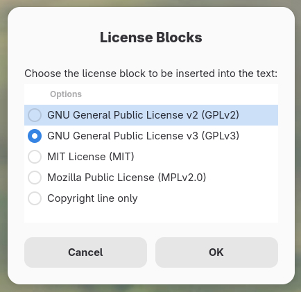

AutoKey's Dialog Menus
======================

AutoKey has a set of "dialog_" script API methods that can be used to display pop-up windows from a script.  In the following example we will construct a "list_menu" dialog from which we select a license block to insert at the top of a source code file.  Under the covers, this dialog is selecting which one of five AutoKey scripts to run.  Each script inserts its own license block text into the file currently open in an editor on the desktop.

.. _dialog: ../api/gtkdialog.html

The Dialog Script
-----------------

::

    #  Select license blocks from a menu
    
    #  Enable script output to the Autokey application log
    import logging
    from autokey.common import APP_NAME
    script_logger = logging.getLogger(APP_NAME + ".license.script")
    
    #  We'll use this later
    window_class = window.get_active_class()
    script_logger.debug(f'window_class = {window_class}')
    
    licenses = (
        'GNU General Public License v2 (GPLv2)',
        'GNU General Public License v3 (GPLv3)',
        'MIT License (MIT)',
        'Mozilla Public License (MPLv2.0)',
        'Copyright line only'
    )
    (rc, menu_choice) = dialog.list_menu(
        licenses, 
        title="License Blocks", 
        message="Choose the license block to be inserted into the text:", 
        default='GNU General Public License v3 (GPLv3)',
        height='400'
    )
    script_logger.debug(f'License menu returned RC = {rc} and menu_choice = "{menu_choice}"')
    
    #  Need to send a key to wake up geany windows
    if rc == 0 and window_class == 'geany':
        keyboard.send_keys('<enter>')
    
    if menu_choice == 'GNU General Public License v2 (GPLv2)':
        engine.run_script('GPLv2')
    elif menu_choice == 'GNU General Public License v3 (GPLv3)':
        engine.run_script('GPLv3')
    elif menu_choice == 'MIT License':
        engine.run_script('MIT')
    elif menu_choice == 'Mozilla Public License (MPL)':
        engine.run_script('MPLv2.0')
    elif menu_choice == 'Copyright line only':
        engine.run_script('Copyright')
    
Supporting Scripts
------------------

It's not important to the dialog, but I have defined an abbreviation for each of the following scripts.  I can use them to invoke each script directly.  The dialog is an alternative for when I forget what those abbreviations are. 😀

The "Copyright" Script
^^^^^^^^^^^^^^^^^^^^^^

::

    import datetime
    keyboard.send_keys(f'# Copyright (C) {datetime.datetime.now().year} David King <dave@daveking.com>')

The "GPLv2" Script
^^^^^^^^^^^^^^^^^^

::

    import datetime
    keyboard.send_keys(f"""#  Copyright (C) {datetime.datetime.now().year} David King <dave@daveking.com>
    #
    #  This program is free software; you can redistribute it and/or
    #  modify it under the terms of the GNU General Public License,
    #  version 2, as published by the Free Software Foundation.
    #
    #  This program is distributed in the hope that it will be useful,
    #  but WITHOUT ANY WARRANTY; without even the implied warranty of
    #  MERCHANTABILITY or FITNESS FOR A PARTICULAR PURPOSE.  See the
    #  GNU General Public License for more details.
    #
    #  You should have received a copy of the GNU General Public License,
    #  version 2, along with this program; if not, see 
    #  <https://www.gnu.org/licenses/old-licenses/gpl-2.0.html>.
    #
    #####################################################################
    """)

The "GPLv3" Script
^^^^^^^^^^^^^^^^^^

::

    import datetime
    keyboard.send_keys(f"""#  Copyright (C) {datetime.datetime.now().year} David King <dave@daveking.com>
    #
    #  This program is free software: you can redistribute it and/or modify
    #  it under the terms of the GNU General Public License as published by
    #  the Free Software Foundation, either version 3 of the License, or
    #  (at your option) any later version.
    #
    #  This program is distributed in the hope that it will be useful,
    #  but WITHOUT ANY WARRANTY; without even the implied warranty of
    #  MERCHANTABILITY or FITNESS FOR A PARTICULAR PURPOSE.  See the
    #  GNU General Public License for more details.
    #
    #  You should have received a copy of the GNU General Public License
    #  along with this program.  If not, see <http://www.gnu.org/licenses/>.
    #
    #####################################################################
    """)

The "MIT" Script
^^^^^^^^^^^^^^^^

::

    import datetime
    keyboard.send_keys(f"""#  MIT License
    #
    #  Copyright (C) {datetime.datetime.now().year} David King <dave@daveking.com>
    #
    #  Permission is hereby granted, free of charge, to any person obtaining a copy
    #  of this software and associated documentation files (the "Software"), to deal
    #  in the Software without restriction, including without limitation the rights
    #  to use, copy, modify, merge, publish, distribute, sublicense, and/or sell
    #  copies of the Software, and to permit persons to whom the Software is
    #  furnished to do so, subject to the following conditions:
    #
    #  The above copyright notice and this permission notice shall be included in all
    #  copies or substantial portions of the Software.
    #
    #  THE SOFTWARE IS PROVIDED "AS IS", WITHOUT WARRANTY OF ANY KIND, EXPRESS OR
    #  IMPLIED, INCLUDING BUT NOT LIMITED TO THE WARRANTIES OF MERCHANTABILITY,
    #  FITNESS FOR A PARTICULAR PURPOSE AND NONINFRINGEMENT. IN NO EVENT SHALL THE
    #  AUTHORS OR COPYRIGHT HOLDERS BE LIABLE FOR ANY CLAIM, DAMAGES OR OTHER
    #  LIABILITY, WHETHER IN AN ACTION OF CONTRACT, TORT OR OTHERWISE, ARISING FROM,
    #  OUT OF OR IN CONNECTION WITH THE SOFTWARE OR THE USE OR OTHER DEALINGS IN THE
    #  SOFTWARE.
    """)

The "MPLv2.0" Script
^^^^^^^^^^^^^^^^^^^^

::

    import datetime
    keyboard.send_keys(f"""#  Copyright (C) {datetime.datetime.now().year} David King <dave@daveking.com>
    #
    #  This Source Code Form is subject to the terms of the Mozilla Public License,
    #  v. 2.0.  If a copy of the MPL was not distbuted with this file, You can
    #  obtain one at https://mozilla.org/MPL/2.0/.
    """)
