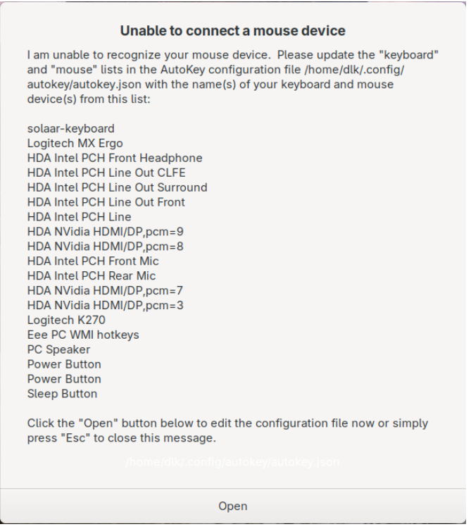
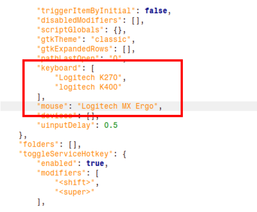
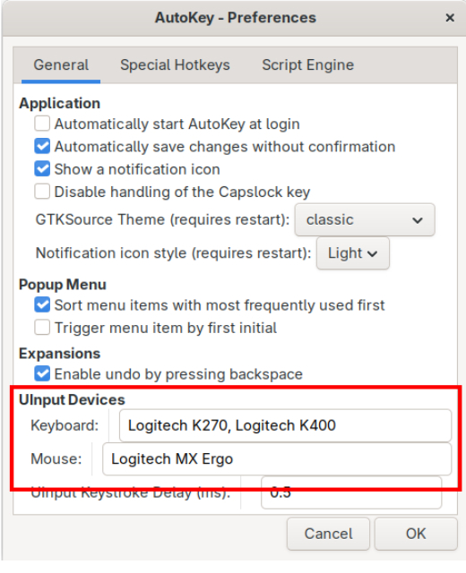

AutoKey tells me it can't find my keyboard/mouse
================================================

AutoKey on Wayland tries to connect to all of the keyboards and mice attached to the system.  However, it only recognizes devices that have the word "keyboard" or "mouse" in their names, so it may not have recognized your device(s).  You will get a pop-up error message from AutoKey if it can't recognize at least one keyboard and one mouse:

As the message says, you should enter the names of the keyboard and mouse devices into the AutoKey configuration file:

First step, you need to find and remember the exact names of the devices you want to add, as they are given in the list provided by the pop-up message.  Then, when you click the "Open" button, you will be placed into an edit session with the AutoKey configuration file.  You need to enter the keyboard and mouse names in the <code>keyboard: []</code> and <code>mouse: []</code> lists as shown in the edit session below:

This example demonstrates that the values can be a list of device names enclosed in brackets (<code>[]</code>) or a single device name as a string.  The Logitech K400 is a USB keyboard that I don't always have attached to the system, but I include it here so that AutoKey will recognize it when I do plug it in.  AutoKey can recognize new devices when they are plugged into a running system provided it knows their names, or their names have the words "keyboard" or "mouse" in them, same as before.

Now, when I restart AutoKey, I see this in the debug log::

  2026-02-09 12:44:53,562 DEBUG - autokey.uinput_interface - The following devices are available on this system:
          solaar-keyboard
          Logitech MX Ergo
          HDA Intel PCH Front Headphone
          HDA Intel PCH Line Out CLFE
          HDA Intel PCH Line Out Surround
          HDA Intel PCH Line Out Front
          HDA Intel PCH Line
          HDA NVidia HDMI/DP,pcm=9
          HDA NVidia HDMI/DP,pcm=8
          HDA Intel PCH Front Mic
          HDA Intel PCH Rear Mic
          HDA NVidia HDMI/DP,pcm=7
          HDA NVidia HDMI/DP,pcm=3
          Logitech K270
          Eee PC WMI hotkeys
          PC Speaker
          Power Button
          Power Button
          Sleep Button
  2026-02-09 12:44:53,562 DEBUG - autokey.uinput_interface - I grabbed these devices from that list: 
          solaar-keyboard
          Logitech K270
          Logitech MX Ergo

AutoKey has recognized and "grabbed" my keyboard and mouse devices.

Once AutoKey is running, the keyboard and mouse device names can be adjusted in AutoKey's Edit ⮞ Preferences dialog.

